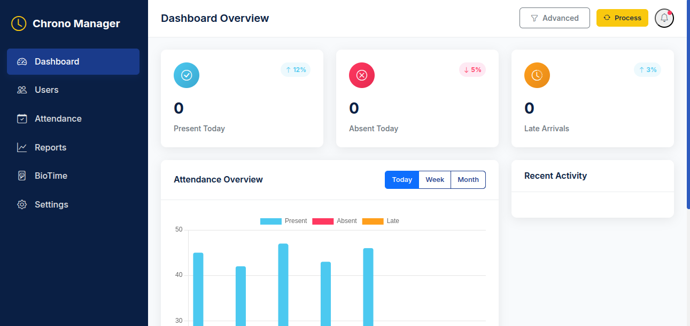
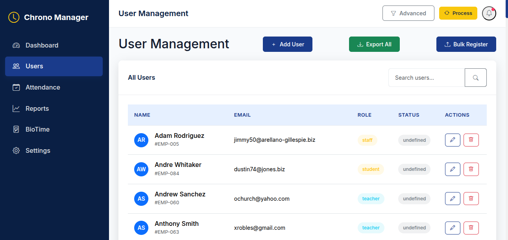

# **Chrono-Manager: Advanced Attendance Management System**

  
_A modern, cross-platform attendance tracking system with BioTime integration, SMS notifications, and real-time analytics._

---

## **📌 Table of Contents**

1. [Key Features](#-key-features)
2. [System Architecture](#-system-architecture)
3. [Installation](#-installation)
4. [Configuration](#-configuration)
5. [API Documentation](#-api-documentation)
6. [Deployment](#-deployment)
7. [Troubleshooting](#-troubleshooting)
8. [Contributing](#-contributing)
9. [License](#-license)

---

## **✨ Key Features**

| Feature                              | Description                                            |
| ------------------------------------ | ------------------------------------------------------ |
| **📊 Real-Time Attendance Tracking** | Sync with BioTime devices for automated check-ins/outs |
| **📱 SMS Notifications**             | Alert parents when students check in/out               |
| **🔍 Advanced Search & Filtering**   | Find attendance records by date, user, or status       |
| **📤 Bulk User Import/Export**       | CSV-based batch processing                             |
| **📈 Analytics Dashboard**           | Visualize attendance trends and compliance             |
| **🔄 Auto-Sync with BioTime**        | Continuous polling or WebSocket-based updates          |
| **🔒 Role-Based Access**             | Separate views for admins, teachers, and staff         |
| **📝 Audit Logging**                 | Track all system changes                               |

---

## **🏗 System Architecture**

```mermaid
graph TD
    A[Frontend (Tauri/React)] -->|HTTP/WS| B[Backend (Node.js/Express)]
    B --> C[(SQLite Database)]
    B --> D[BioTime API]
    B --> E[SMS Gateway]
    D -->|WebSocket/Polling| B
```

### **Tech Stack**

- **Frontend**: Tauri (Rust + WebView)
- **Backend**: Node.js, Express
- **Database**: SQLite (with optional PostgreSQL support)
- **Biometric Integration**: BioTime API
- **Notifications**: EgoSMS (SMS), Nodemailer (Email)
- **Logging**: Custom Logger with file rotation

---

## **🛠 Installation**

### **Prerequisites**

- Node.js ≥ 16.x
- Rust (for Tauri)
- SQLite3
- BioTime API credentials

### **Steps**

1. **Clone the repository**

   ```bash
   git clone https://github.com/your-repo/chrono-manager.git
   cd chrono-manager
   ```

2. **Install dependencies**

   ```bash
   npm install
   cd src-tauri && cargo build
   ```

3. **Configure environment variables**

   ```bash
   cp .env.example .env
   # Edit .env with your BioTime/SMS credentials
   ```

4. **Initialize the database**

   ```bash
   npm run migrate
   ```

5. **Run the application**
   ```bash
   npm run dev  # Development
   npm start    # Production
   ```

---

## **⚙ Configuration**

### **BioTime Setup**

1. Update `biotime_config` table with:

   ```sql
   INSERT INTO biotime_config (ip_address, username, password)
   VALUES ('YOUR_BIOTIME_IP', 'admin', 'securepassword');
   ```

2. **Polling Interval** (Optional)
   ```javascript
   // In services/attendancePoller.js
   const poller = new AttendancePoller(15000); // 15 seconds
   ```

### **SMS Notifications**

Configure in `.env`:

```ini
apiUrl=your_sid
username=your_token
password=+1234567890
```

---

## **🌐 API Documentation**

### **Endpoints**

| Endpoint               | Method | Description               |
| ---------------------- | ------ | ------------------------- |
| `/api/attendance`      | GET    | Fetch attendance records  |
| `/api/users/bulk`      | POST   | Bulk import users via CSV |
| `/api/biotime/process` | POST   | Force sync with BioTime   |
| `/api/sms/send`        | POST   | Manual SMS trigger        |

[📚 Full API Docs](docs/API.md)

---

## **🚀 Deployment**

### **1. Native Build (Tauri)**

```bash
npm run tauri build
# Output: ./src-tauri/target/release/chrono-manager
```

### **2. Docker (Backend Only)**

```bash
docker build -t chrono-manager .
docker run -p 3000:3000 chrono-manager
```

### **3. PM2 (Production Node.js)**

```bash
pm2 start server.js --name chrono-manager
```

---

## **🐛 Troubleshooting**

| Issue                           | Solution                                            |
| ------------------------------- | --------------------------------------------------- |
| **"BioTime connection failed"** | Verify IP/credentials in `biotime_config`           |
| **SMS not sending**             | Check EgoSMS credentials in `.env`                  |
| **High CPU usage**              | Increase polling interval                           |
| **Database locked**             | Ensure SQLite is not accessed by multiple processes |

**Logs Location:** `./logs/app_*.log`

---

## **🤝 Contributing**

1. Fork the repository
2. Create a feature branch (`git checkout -b feature/xyz`)
3. Submit a Pull Request

**Coding Standards:**

- ESLint (Airbnb style)
- Commit messages follow [Conventional Commits](https://www.conventionalcommits.org)

---

## **📜 License**

MIT © 2025 Kasimlyee

---

**📢 Need Help?**  
Open an issue or contact [kasiimlyee@gmail.com](mailto:support@chronomanager.com).

**🌟 Star the Project** if you find it useful!

---

### **Screenshots**

| Dashboard                          | User Management           |
| ---------------------------------- | ------------------------- |
|  |  |

[⬆ Back to Top](#-chrono-manager-advanced-attendance-management-system)
